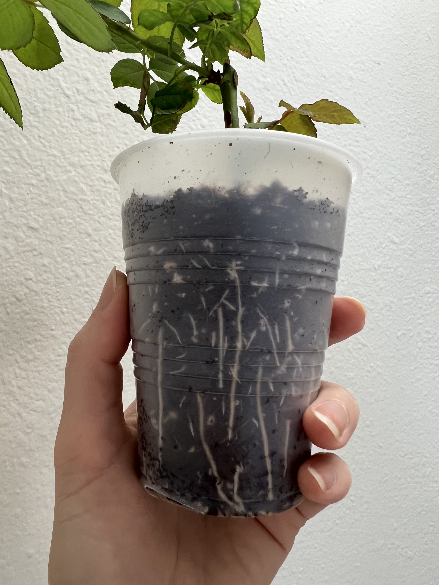

# 🌹 Newly Rooted Rose Cutting Care Guide

Thank you for adopting a baby rose cutting! These cuttings are newly rooted and still delicate, so gentle care during the next few weeks will help them grow into strong, healthy plants.

---

## ☀️ Light Requirements

### **Outdoor Option (Preferred but needs protection from freezes)**
- Place the cup **outdoors** where it receives **morning sun** and **afternoon shade**.
- **Avoid harsh midday sun** until the plant is more established.

### **Cold Weather Protection**
- These babies **cannot handle freezing temperatures** yet.
- If temperatures drop to freezing:
  - **Bring the rose indoors** until the freeze passes **OR**
  - Cover it outdoors using a **frost blanket while placed next to a house wall**.

### **Indoor Option**
- You *can* keep it fully indoors for the winter but bring it outdoors once spring is here.
- Place it directly in front of a **very bright window** and/or use **grow lights**.
- Roses are more likely to get **pests when kept indoors**, so make a habit of **checking regularly** and **treating for any pests promptly**.

---

## 💧 Watering
- **Watering from the bottom** is the safest option while the roots are still developing, but gentle top-watering is fine as long as you **don’t overwater**.
- Water about **1–2 times per week**, or whenever the top **1 inch** of soil feels dry. As the roots fill out the cup more, you may need to water **more frequently**, sometimes even **daily**.
- Keep the soil **moist but not soggy**. Young roses can **rot easily** if the soil stays too wet while their roots are still small and developing.

---

## 🌱 **Repotting Instructions**

*Roots should fill the cup like this before moving up to a larger pot.*

- Keep the cutting in the **9oz cup** until the roots have filled the cup and look similar to the example photo.
- Move the rose into a **2-quart to 1-gallon pot**. A 2-quart pot is the safer option but you will need to repot sooner.
- **Keep the original soil as intact as possible.** If the cutting has developed enough roots, the root system will naturally **hold the soil together** when you lift it out of the cup.
- Use a **well-draining potting soil mix**.
- *(Optional)* Water the rose in with **Superthrive** or a **diluted kelp fertilizer** to help **reduce transplant shock**.

---

## 🌿 Fertilizing
You can fertilize once every **2–3 weeks** with a **liquid fertilizer**.

### **Fertilizer Options**
- **½ strength Fish Fertilizer**
- **¼ – ½ strength strength All-Purpose Synthetic Fertilizer (ex: Miracle-Gro, Fox Farm Grow Big, Dyna-Gro Foliage-Pro)**
- **Great Big Roses Compost Extract** (full strength is fine, it’s very gentle and won’t burn young roots)

*Avoid using **granular rose fertilizers** at this stage — they are **too strong** for newly rooted cuttings and can easily burn young roots.*

---
